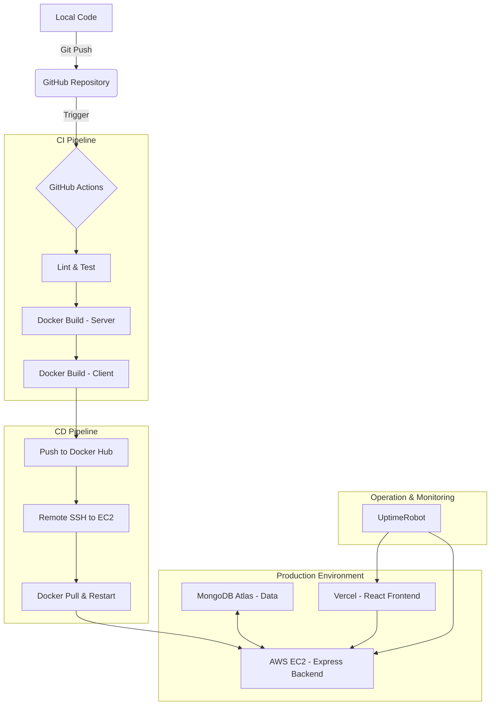

# 🔄 Detailed MERN DevOps Workflow

This document outlines the architectural flow of your code from a local commit to a production-ready deployment.

## CI/CD Workflow Diagram

## Stage-by-Stage Breakdown

### 🛠️ 1. Local Development
- **Source Control**: You write code and commit changes locally using Git.
- **Local Testing**: Run `docker-compose up` to verify both server and client work together in containers.

### 🚀 2. GitHub Actions (The Automation Engine)
Once you push to the `main` branch:
- **Build**: GitHub Actions spins up a runner, builds your Docker images (server/client).
- **Security Check**: Images are scanned for basic vulnerabilities.
- **Push**: The images are tagged (e.g., `v1.0.1`) and pushed to **Docker Hub**.

### 🏗️ 3. Deployment Targets
- **Backend (AWS EC2)**:
  - GitHub Actions uses SSH to log into your EC2 instance.
  - It pulls the latest image from Docker Hub.
  - It uses `docker run` to restart the container with updated code.
- **Frontend (Vercel)**:
  - Vercel automatically detects the push to GitHub.
  - It performs its own build (Optimized Vite build).
  - It deploys the static assets to a global CDN.

### 💾 4. Persistence (MongoDB Atlas)
- Your backend container connects to the managed MongoDB Atlas cluster via a secure connection string.
- Atlas handles backups, scaling, and high availability.

### 🛡️ 5. Monitoring (UptimeRobot)
- UptimeRobot pings your URLs every 5 minutes.
- If the EC2 instance goes down or Vercel has an issue, you receive an instant notification.
