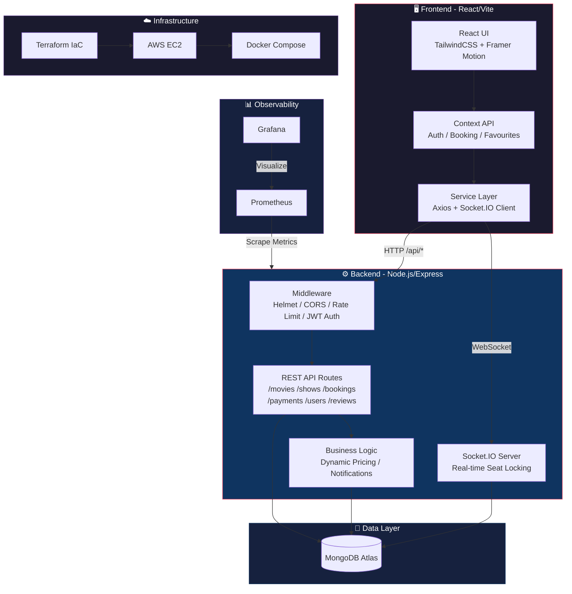
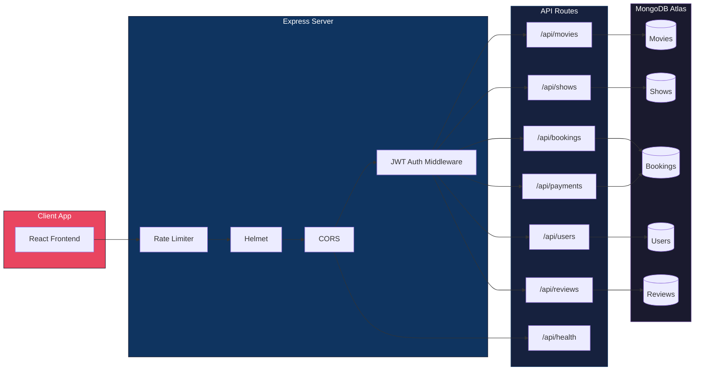
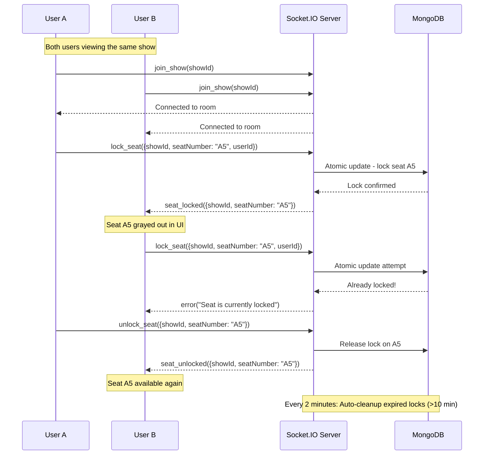
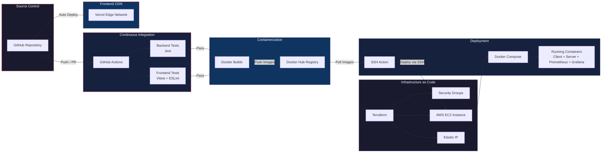
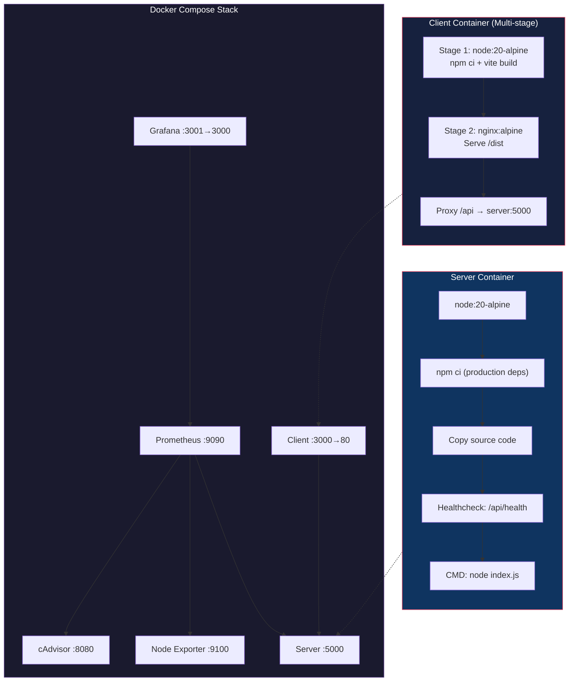
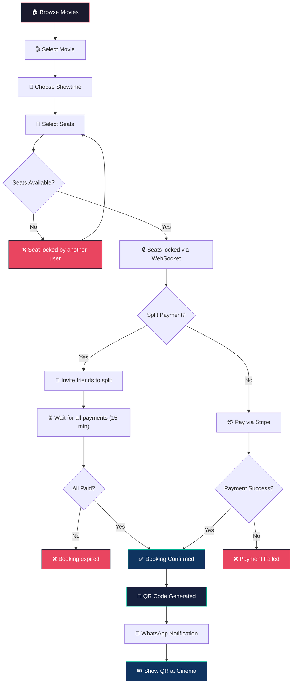
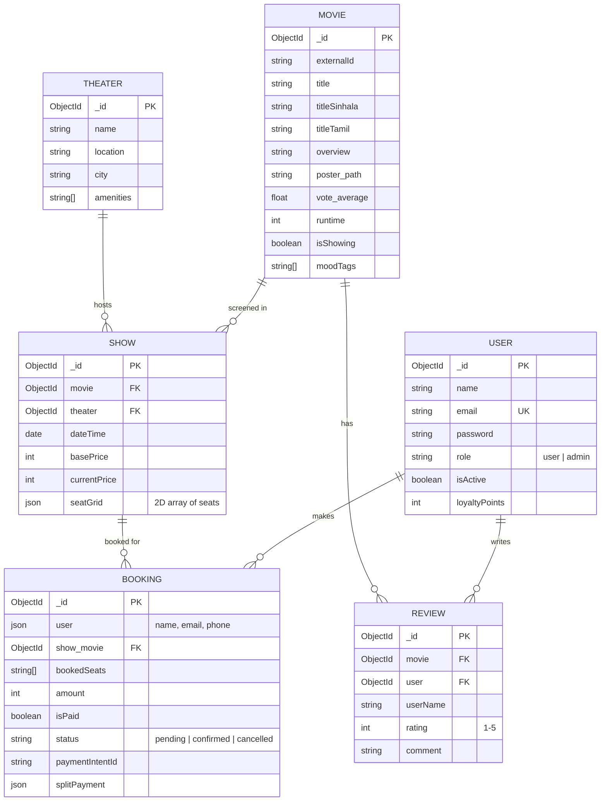

# Lankan Primire

Welcome to the **Lankan Primire** repository! 🎬 This is a full-stack movie digital ticketing application designed to provide a seamless cinema booking experience. 

This README outlines the **Application Features**, **API Architecture**, and **DevOps/CI/CD pipeline** behind the project.

---

## ✨ Features
- **Movie Catalog & Scheduling**: Browse currently airing and upcoming movies, view details, trailers, and scheduled showtimes.
- **Real-Time Seat Reservation**: Interactive theater layout with live seat locking via WebSockets to prevent double-bookings.
- **Secure Payment Gateway**: End-to-end secure ticketing transactions utilizing Stripe.
- **Digital Ticketing**: Scannable QR code generation for digital ticket validation at the cinema.
- **User Reviews & Ratings**: Allow users to share community feedback and rate movies.
- **Robust Security**: Rate limiting, Helmet HTTP headers, JWT authentication, and secure Docker-based deployment.

---

## 🏗️ Technology Stack
- **Frontend**: React, Vite, TailwindCSS, Framer Motion
- **Backend**: Node.js, Express.js, Socket.IO
- **Database**: MongoDB (Atlas)
- **Infrastructure & Cloud**: AWS (EC2, Elastic IP), Terraform
- **Containerization**: Docker, Docker Compose
- **CI/CD**: GitHub Actions
- **Observability**: Prometheus & Grafana (WIP)

---

## 🧩 System Architecture



---

## 📂 Project Structure

```text
lankan-primire/
├── .github/workflows/     # CI/CD pipelines (GitHub Actions)
├── client/                # React/Vite Frontend Application
│   ├── public/            # Static client assets
│   ├── src/
│   │   ├── components/    # Reusable UI components
│   │   ├── pages/         # View pages (Home, Movie, Booking, etc.)
│   │   ├── services/      # Backend API communication triggers
│   │   ├── context/       # React Context state management
│   │   └── hooks/         # Custom React hooks
│   ├── package.json       # Client dependencies
│   └── Dockerfile         # Client container build instructions
├── infrastructure/        # Infrastructure as code
│   └── terraform/         # Terraform configurations targeting AWS
├── server/                # Node.js/Express Backend Application
│   ├── models/            # Mongoose schemas (Movie, Booking, Show, User)
│   ├── routes/            # Express REST route controllers
│   ├── services/          # Heavy business logic and WebSocket management
│   ├── middleware/        # Custom Express middleware (e.g. auth validation)
│   ├── package.json       # Server dependencies
│   └── Dockerfile         # Server container build instructions
├── docker-compose.yml     # Local multi-container setup (DB, Client, Server)
└── README.md              # Project documentation (You are here!)
```

---

## 🔌 API Architecture & How It Works

The backend provides a RESTful JSON API alongside a real-time WebSocket connection to handle high-concurrency tasks like seat selection.

### Core REST Endpoints
The Express server exposes the following main resource endpoints routed through `/api/*`:
- `GET/POST /api/movies`: Fetch movie catalogs, individual movie details, or add new movies.
- `GET/POST /api/shows`: Retrieve theater schedules, screening dates, and time slots.
- `GET/POST /api/bookings`: View user booking history, create new booking records, and manage seat reservations.
- `POST /api/payments`: Communicates securely with the Stripe API to generate Payment Intents and confirm transactions.
- `GET/POST /api/users`: Handle user profiles, Clerk authentication webhooks, and preferences.
- `GET/POST /api/reviews`: Submit text reviews and star ratings, or fetch community reviews for a specific movie.
- `GET /api/health`: Provides a diagnostic check of the server and database connection status.



### Real-Time Socket.IO Logic
Because multiple users might try to book the same prime seat simultaneously, we use **Socket.IO** for live synchronization:
- `join_show`: Groups users viewing the same screening into a specific Socket room.
- `lock_seat`: When a user clicks a seat, an event is emitted to instantly gray it out for everyone else viewing that show. This prevents race conditions.
- `unlock_seat`: If a user changes their mind or their session expires, the seat is released back to the general pool for other users.
- **Auto-Cleanup**: A cron-style background interval sweeps the database every 2 minutes to forcefully release any seats locked by inactive users who abandoned their session.



---

## ⚙️ DevOps Pipeline & Architecture

This project adopts a modern infrastructure-as-code and automated CI/CD approach, allowing for reliable and highly available zero-touch deployments.



### 1. Source Control & Continuous Integration (CI)
Our pipeline uses **GitHub Actions** (`.github/workflows/ci.yml`) to govern code quality. When code is pushed or a PR is opened against the `main` branch:
- **Backend Tests**: Configures Node.js, installs server dependencies (`npm ci`), and runs the backend test suite using Jest.
- **Frontend Tests & Linting**: Installs client dependencies, enforces strict formatting guidelines (`npm run lint`), and executes Vitest for UI components.

### 2. Containerization (Docker)
Both the client and server applications are containerized using **Docker**:
- During a deployment to `main`, the CI workflow builds Docker images using `docker buildx`.
- Caching is configured through Docker registry caches to significantly speed up build times.
- Immutable images are tagged with both `latest` and a unique `github.sha` to enable safe rollbacks, and then pushed to **Docker Hub**.



### 3. Infrastructure as Code (Terraform)
Hardware provision is declarative, managed via **Terraform** (`infrastructure/terraform/main.tf`).
- **VPC & Security**: Provisions a tight Security Group restricting to essential ports: SSH (22), HTTP (80 - Client), and App Ports (5000/3000).
- **Compute**: Deploys a free-tier eligible AWS EC2 Instance.
- **Network**: An AWS Elastic IP is attached to the instance ensuring a stable public IP across reboots or redeployments.
- **Bootstrap Script (User Data)**: Automatically installs Docker on instance boot, creates a custom `lankan-net` Docker network bridge, and initializes the environment.

### 4. Continuous Deployment (CD)
If the CI phase passes successfully, GitHub Actions orchestrates the application update directly on AWS EC2 without any downtime:
- Authorizes with the EC2 instance using an SSH Deploy Key (`appleboy/ssh-action`).
- Safely halts and removes existing `client` and `server` containers.
- Pulls the newest lightweight built images from Docker Hub.
- Leverages Docker run configurations with proper environment variable seeding (e.g., `MONGODB_URI`, `JWT_SECRET`).
- Evaluates container health for stability and automatically prunes old unused images to save block storage space.

### 5. Frontend Deployment (Vercel)
For the best performance and developer experience, the React frontend can be deployed directly on **Vercel**:
- **Automatic Builds**: Vercel detects the `client/` directory and `vite` framework automatically via the root `vercel.json`.
- **Environment Variables**: Configure `VITE_API_URL` and `VITE_API_BASE_URL` in the Vercel dashboard to point to your backend (e.g., your AWS EC2 IP).
- **Global Edge Network**: Ensures the UI is delivered instantly to users worldwide.

---

## 💻 Local Development Setup

We utilize `docker-compose` to replicate our production architecture locally. 

### Prerequisites:
- Docker and Docker Compose installed.
- Setup a `.env` file in the `./server` folder including your `MONGODB_URI` and `JWT_SECRET`.

### Getting Started:

1. Clone the repository:
   ```bash
   git clone https://github.com/your-username/lankan-primire.git
   ```

2. Boot the cluster:
   ```bash
   docker-compose up --build
   ```

This spins up:
- The backend Node API on `http://localhost:5000`
- The frontend React UI on `http://localhost:3000`
- An isolated MongoDB container database locally on port `27017`

---

## 🔒 Secrets Management
To duplicate the automated deployment pipeline on your own GitHub fork, ensure the following Repository Secrets are populated in the GitHub repository's specific settings:
- `DOCKER_USERNAME`: Your Docker Hub identity.
- `DOCKER_PASSWORD`: Your Docker Hub Access Token.
- `SSH_PRIVATE_KEY`: Your SSH key pairing with the deployed EC2 metadata for Github Action handshakes.
- `EC2_IP`: The public Elastic IP deployed by Terraform.
- `EC2_USER`: Generally `ubuntu` for AWS EC2 instances.
- `MONGODB_URI`: Production Atlas cluster connection string.
- `JWT_SECRET`: Safe encryption key for JWT.

---

## 🎫 Booking Flow

The end-to-end user journey from browsing movies to receiving a digital ticket:



---

## 📊 Database Schema


