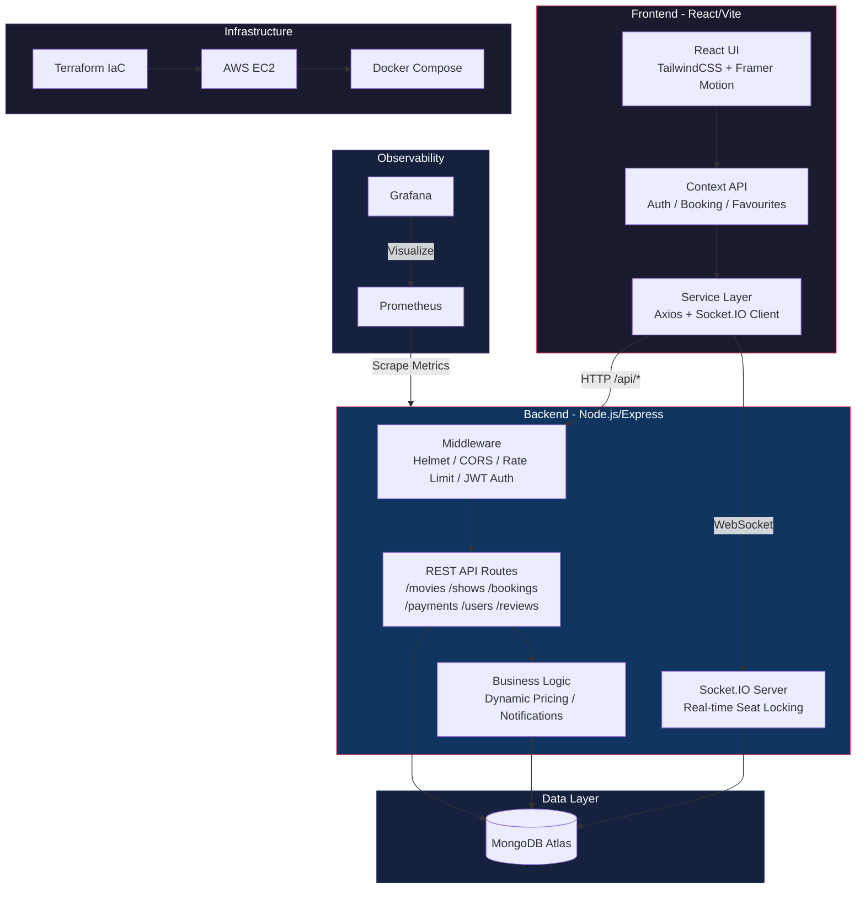
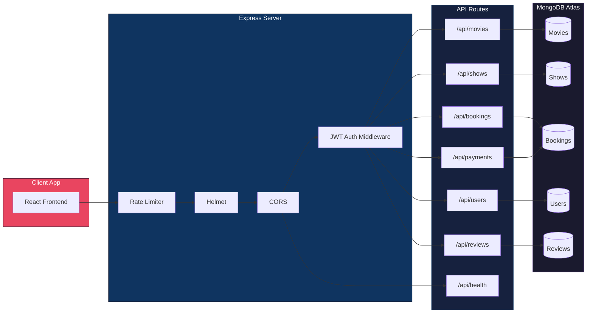
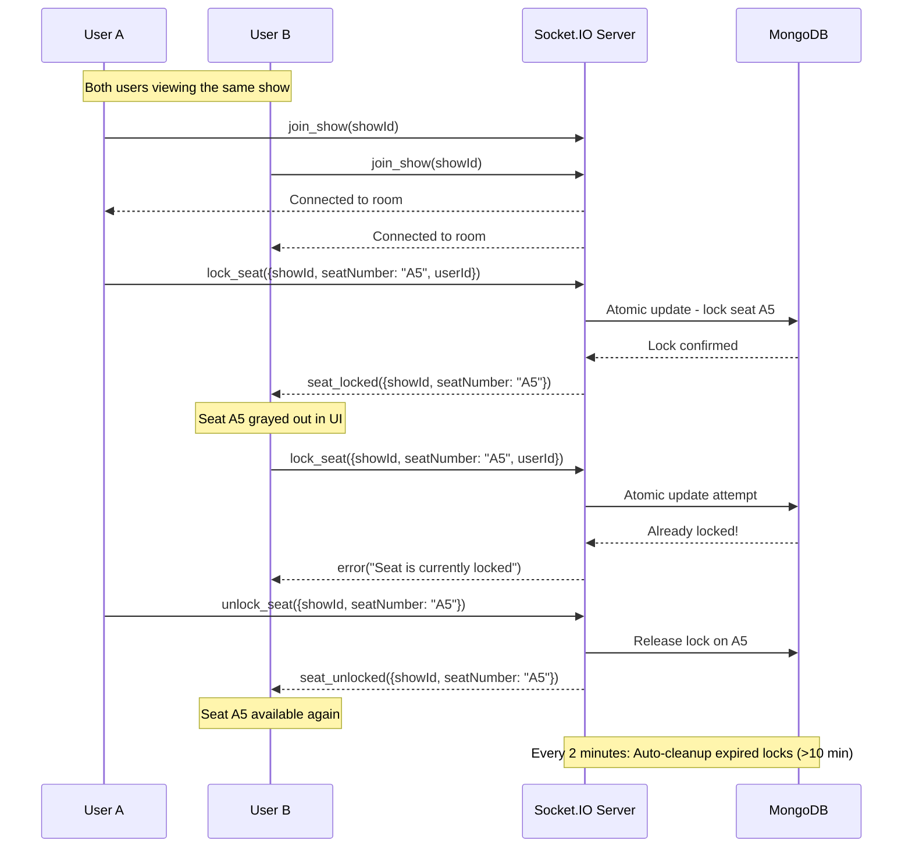
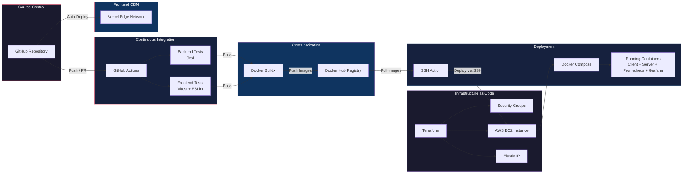
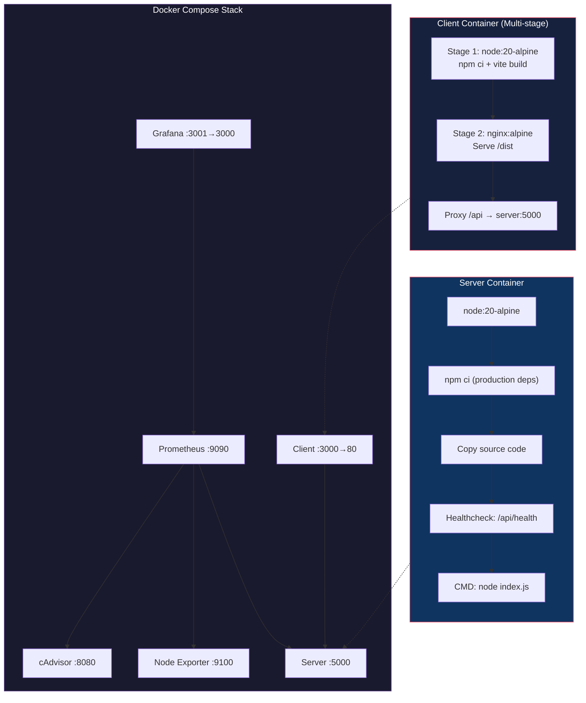
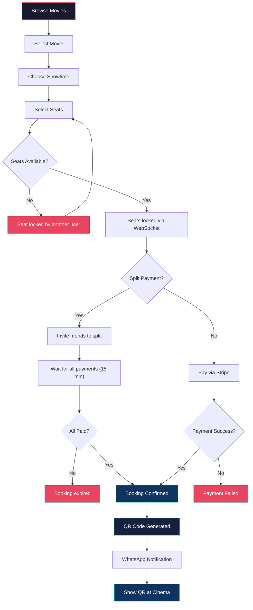
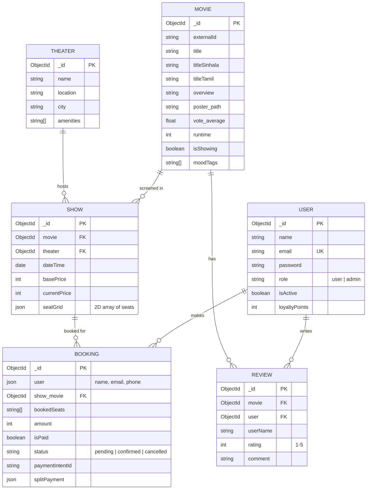

# 🎬 Lankan Primire - Full-Stack & DevOps Portfolio Project

[](.github/workflows/ci.yml)
[](infrastructure/terraform)
[](k8s)
[](.github/workflows/ci.yml)
[](server/swagger.json)

**Production Web App:** [https://lankan-primire.vercel.app/](https://lankan-primire.vercel.app/)  
**Interactive API Documentation:** `http://localhost:5000/api-docs`  

**Lankan Primire** is an enterprise-grade full-stack cinema management and ticketing web application designed to demonstrate modern software development, high-concurrency real-time WebSocket synchronization, DevSecOps pipelines, and production cloud infrastructure automation.

---

## 🌟 Key Features & Implementation Highlights

* **Real-time Seat Locking (Concurrency Control):** Socket.IO synchronization preventing double-booking race conditions through atomic MongoDB locks and 2-minute background TTL lock cleanup.
* **OpenAPI / Swagger Integration:** Interactive API documentation accessible at `/api-docs`.
* **Digital QR Code Ticketing & Split Payments:** Scannable QR code generation for ticket validation and multi-user split checkout.
* **DevSecOps Pipeline:** GitHub Actions automated testing, `npm audit`, and **Trivy container image security scanning**.
* **Infrastructure as Code (Terraform):** Reproducible AWS EC2, Elastic IP, and Security Group provisioning.
* **Kubernetes Orchestration (`k8s/`):** Production Kubernetes manifests including ClusterIP services, Ingress routing, and HorizontalPodAutoscaler (HPA).
* **Observability & Monitoring Stack:** Express metrics collection with `prom-client`, Prometheus scraping, and Grafana visualization dashboards.

---

## 🛠️ Tech Stack & Ecosystem

* **Frontend:** React 18, Vite, TailwindCSS, Framer Motion, Axios, Socket.IO Client
* **Backend:** Node.js, Express.js, Socket.IO, JWT Auth, Helmet, Rate Limiter, Swagger UI
* **Database:** MongoDB Atlas (Cloud) & Local MongoDB
* **Infrastructure & Cloud:** AWS EC2, Elastic IP, Terraform (IaC)
* **Orchestration & Containers:** Docker, Multi-Stage Builds, Docker Compose, Kubernetes (K8s)
* **CI/CD & Security:** GitHub Actions, Vitest, Jest, Trivy Container Vulnerability Scanner
* **Observability:** Prometheus, Grafana, Node Exporter, cAdvisor

---

## Architecture Design


```mermaid
graph TB
    subgraph Client["Frontend - React/Vite"]
        UI[React UI<br/>TailwindCSS + Framer Motion]
        CTX[Context API<br/>Auth / Booking / Favourites]
        SVC[Service Layer<br/>Axios + Socket.IO Client]
    end

    subgraph Server["Backend - Node.js/Express"]
        MW[Middleware<br/>Helmet / CORS / Rate Limit / JWT Auth]
        API[REST API Routes<br/>/movies /shows /bookings<br/>/payments /users /reviews]
        WS[Socket.IO Server<br/>Real-time Seat Locking]
        BL[Business Logic<br/>Dynamic Pricing / Notifications]
    end

    subgraph Data["Data Layer"]
        DB[(MongoDB Atlas)]
    end

    subgraph Infra["Infrastructure"]
        EC2[AWS EC2]
        TF[Terraform IaC]
        DOCKER[Docker Compose]
    end

    subgraph Monitoring["Observability"]
        PROM[Prometheus]
        GRAF[Grafana]
    end

    UI --> CTX --> SVC
    SVC -- "HTTP /api/*" --> MW --> API --> DB
    SVC -- "WebSocket" --> WS --> DB
    API --> BL --> DB
    EC2 --> DOCKER
    TF --> EC2
    PROM -- "Scrape Metrics" --> Server
    GRAF -- "Visualize" --> PROM

    style Client fill:#1a1a2e,stroke:#e94560,color:#fff
    style Server fill:#0f3460,stroke:#e94560,color:#fff
    style Data fill:#16213e,stroke:#0f3460,color:#fff
    style Infra fill:#1a1a2e,stroke:#533483,color:#fff
    style Monitoring fill:#16213e,stroke:#533483,color:#fff
```

---

## Project Structure

```text
lankan-primire/
├── .github/workflows/     # CI/CD pipelines (GitHub Actions)
├── client/                # React/Vite Frontend Application
│   ├── public/            # Static client assets
│   ├── src/
│   │   ├── components/    # Reusable UI components
│   │   ├── pages/         # View pages (Home, Movie, Booking, etc.)
│   │   ├── services/      # Backend API communication triggers
│   │   ├── context/       # React Context state management
│   │   └── hooks/         # Custom React hooks
│   ├── package.json       # Client dependencies
│   └── Dockerfile         # Client container build instructions
├── infrastructure/        # Infrastructure as code
│   └── terraform/         # Terraform configurations targeting AWS
├── server/                # Node.js/Express Backend Application
│   ├── models/            # Mongoose schemas (Movie, Booking, Show, User)
│   ├── routes/            # Express REST route controllers
│   ├── services/          # Heavy business logic and WebSocket management
│   ├── middleware/        # Custom Express middleware (e.g. auth validation)
│   ├── package.json       # Server dependencies
│   └── Dockerfile         # Server container build instructions
├── docker-compose.yml     # Local multi-container setup (DB, Client, Server)
└── README.md              # Project documentation
```

---

## API Architecture & Routing

The backend server serves standard REST endpoints for CRUD actions and handles real-time seat locks using WebSockets.

### REST Endpoints
All endpoints are prefix-routed through `/api/*` and return JSON payloads:
* `GET/POST /api/movies`: Fetch catalog metadata or add entries.
* `GET/POST /api/shows`: Retrieve theater time slots and seat configurations.
* `GET/POST /api/bookings`: Fetch booking records or process ticket checkout.
* `POST /api/payments`: Connects to Stripe API to complete seat purchases.
* `GET/POST /api/users`: Manage profile schemas and webhook handles.
* `GET/POST /api/reviews`: Process user feedback and ratings.
* `GET /api/health`: Basic diagnostic ping returning server and database connection status.


```mermaid
graph LR
    subgraph Client["Client App"]
        R[React Frontend]
    end

    subgraph Gateway["Express Server"]
        RL[Rate Limiter]
        HM[Helmet]
        CORS_MW[CORS]
        AUTH[JWT Auth Middleware]
    end

    subgraph Routes["API Routes"]
        M["/api/movies"]
        S["/api/shows"]
        B["/api/bookings"]
        P["/api/payments"]
        U["/api/users"]
        RV["/api/reviews"]
        H["/api/health"]
    end

    subgraph DB["MongoDB Atlas"]
        Movies[(Movies)]
        Shows[(Shows)]
        Bookings[(Bookings)]
        Users[(Users)]
        Reviews[(Reviews)]
    end

    R --> RL --> HM --> CORS_MW
    CORS_MW --> AUTH
    AUTH --> M & S & B & P & U & RV
    CORS_MW --> H
    M --> Movies
    S --> Shows
    B --> Bookings
    P --> Bookings
    U --> Users
    RV --> Reviews

    style Client fill:#e94560,stroke:#1a1a2e,color:#fff
    style Gateway fill:#0f3460,stroke:#1a1a2e,color:#fff
    style Routes fill:#16213e,stroke:#0f3460,color:#fff
    style DB fill:#1a1a2e,stroke:#533483,color:#fff
```

### Real-Time WebSocket Logic
To handle high concurrent traffic and prevent double-booking issues, I used **Socket.IO** to manage seat status:
* `join_show`: Groups clients looking at the same show date into a specific room.
* `lock_seat`: Temporarily locks seat coordinates, updating the state so that the seat shows as grayed out for other users in the room.
* `unlock_seat`: Releases the lock if the user changes their mind or fails to pay.
* **Auto-Cleanup Task:** I set up a background interval that sweeps the database every 2 minutes. It automatically unlocks any seat held for more than 10 minutes by an inactive user, keeping the ticket inventory open.


```mermaid
sequenceDiagram
    participant U1 as User A
    participant U2 as User B
    participant SIO as Socket.IO Server
    participant DB as MongoDB

    Note over U1,U2: Both users viewing the same show

    U1->>SIO: join_show(showId)
    U2->>SIO: join_show(showId)
    SIO-->>U1: Connected to room
    SIO-->>U2: Connected to room

    U1->>SIO: lock_seat({showId, seatNumber: "A5", userId})
    SIO->>DB: Atomic update - lock seat A5
    DB-->>SIO: Lock confirmed
    SIO-->>U2: seat_locked({showId, seatNumber: "A5"})
    Note over U2: Seat A5 grayed out in UI

    U2->>SIO: lock_seat({showId, seatNumber: "A5", userId})
    SIO->>DB: Atomic update attempt
    DB-->>SIO: Already locked!
    SIO-->>U2: error("Seat is currently locked")

    U1->>SIO: unlock_seat({showId, seatNumber: "A5"})
    SIO->>DB: Release lock on A5
    SIO-->>U2: seat_unlocked({showId, seatNumber: "A5"})
    Note over U2: Seat A5 available again

    Note over SIO,DB: Every 2 minutes: Auto-cleanup expired locks (>10 min)
```

---

## DevOps Pipeline & Infrastructure

To simulate a professional environment, I configured automated pipeline jobs, container builds, and cloud hosting.


```mermaid
graph LR
    subgraph SCM["Source Control"]
        GH[GitHub Repository]
    end

    subgraph CI["Continuous Integration"]
        GA[GitHub Actions]
        BT[Backend Tests<br/>Jest]
        FT[Frontend Tests<br/>Vitest + ESLint]
    end

    subgraph Build["Containerization"]
        DB_BUILD[Docker Buildx]
        DH[Docker Hub Registry]
    end

    subgraph IaC["Infrastructure as Code"]
        TF[Terraform]
        SG[Security Groups]
        EC2[AWS EC2 Instance]
        EIP[Elastic IP]
    end

    subgraph Deploy["Deployment"]
        SSH[SSH Action]
        DC[Docker Compose]
        APP["Running Containers<br/>Client + Server + Prometheus + Grafana"]
    end

    subgraph CDN["Frontend CDN"]
        VCL[Vercel Edge Network]
    end

    GH -- "Push / PR" --> GA
    GA --> BT & FT
    BT & FT -- "Pass" --> DB_BUILD
    DB_BUILD -- "Push Images" --> DH
    TF --> SG & EC2 & EIP
    DH -- "Pull Images" --> SSH
    SSH -- "Deploy via SSH" --> EC2
    EC2 --> DC --> APP
    GH -- "Auto Deploy" --> VCL

    style SCM fill:#1a1a2e,stroke:#e94560,color:#fff
    style CI fill:#16213e,stroke:#e94560,color:#fff
    style Build fill:#0f3460,stroke:#533483,color:#fff
    style IaC fill:#1a1a2e,stroke:#533483,color:#fff
    style Deploy fill:#16213e,stroke:#0f3460,color:#fff
    style CDN fill:#0f3460,stroke:#e94560,color:#fff
```

### 1. Continuous Integration (CI)
I set up a GitHub Actions workflow (`.github/workflows/ci.yml`) that runs on pushes or pull requests to the `main` or `dev` branches:
* **Backend Validation:** Installs server dependencies and runs unit tests via Jest.
* **Frontend Validation:** Audits code formatting using ESLint and runs component tests using Vitest.

### 2. Containerization (Docker)
I containerized both the frontend client and the backend server:
* **Docker Build:** The GitHub workflow uses `docker buildx` to compile container images.
* **Tagging:** Images are tagged with the specific commit SHA (for version tracking) and also updated to `latest` before pushing to Docker Hub.


```mermaid
graph TB
    subgraph ServerContainer["Server Container"]
        direction TB
        S_BASE["node:20-alpine"]
        S_DEPS["npm ci (production deps)"]
        S_SRC["Copy source code"]
        S_HEALTH["Healthcheck: /api/health"]
        S_CMD["CMD: node index.js"]
        S_BASE --> S_DEPS --> S_SRC --> S_HEALTH --> S_CMD
    end

    subgraph ClientContainer["Client Container (Multi-stage)"]
        direction TB
        C_BUILD["Stage 1: node:20-alpine<br/>npm ci + vite build"]
        C_NGINX["Stage 2: nginx:alpine<br/>Serve /dist"]
        C_PROXY["Proxy /api → server:5000"]
        C_BUILD --> C_NGINX --> C_PROXY
    end

    subgraph Compose["Docker Compose Stack"]
        SRV[Server :5000]
        CLT[Client :3000→80]
        PRO[Prometheus :9090]
        GRA[Grafana :3001→3000]
        NEX[Node Exporter :9100]
        CAD[cAdvisor :8080]
    end

    ServerContainer -.-> SRV
    ClientContainer -.-> CLT
    CLT --> SRV
    PRO --> SRV & NEX & CAD
    GRA --> PRO

    style ServerContainer fill:#0f3460,stroke:#e94560,color:#fff
    style ClientContainer fill:#16213e,stroke:#e94560,color:#fff
    style Compose fill:#1a1a2e,stroke:#533483,color:#fff
```

### 3. Infrastructure as Code (Terraform)
To learn cloud provisioning, I configured the server setup in Terraform:
* **Networking & Firewalls:** Configured an AWS Security Group exposing ports 22 (SSH), 80/3000/5000 (app endpoints), and 3001/9090 (monitoring metrics).
* **EC2 Instance:** Allocates a t2.micro instance.
* **Static IP:** Attaches an AWS Elastic IP to make sure the IP address remains constant across reboots.
* **Automation:** An AWS User Data bootstrap script installs Docker and initializes folder configurations on first boot.

### 4. Continuous Deployment (CD)
After tests pass and images are built, the pipeline automatically deploys the code:
* **SSH Connection:** Accesses the EC2 instance securely using an SSH deploy key.
* **Secrets Inloading:** Safely writes environment configurations containing MongoDB and Stripe secrets on the host instance.
* **Container Lifecycle:** Pulls the new container images from Docker Hub, restarts the services, and prunes unused images to keep the server storage clean.

### 5. Frontend Hosting (Vercel)
To ensure fast load times, I deployed the frontend to Vercel:
* **Build Integration:** Vercel builds the React client and hosts it statically.
* **Path Mapping:** Rewrites in `vercel.json` forward client API calls to the AWS EC2 backend.

---

## Local Development Setup

To test the multi-service setup on your machine, configure Docker and run the Compose tool.

### Prerequisites:
* Docker and Docker Compose installed.
* Create a `.env` file in the `./server` folder:
  ```env
  MONGODB_URI=your_mongodb_connection_string
  JWT_SECRET=your_jwt_signature_secret
  ```

### Getting Started:
1. Clone the repository:
   ```bash
   git clone https://github.com/your-username/lankan-primire.git
   ```
2. Build and boot the stack:
   ```bash
   docker-compose up --build
   ```
This launches:
* Backend Node API at `http://localhost:5000`
* Frontend React client at `http://localhost:3000`
* MongoDB container running locally on port `27017`

---

## Secrets Management
To set up the automated pipeline for a repository fork, configure these Repository Secrets in your GitHub repository settings:
* `DOCKER_USERNAME`: Your Docker Hub account username.
* `DOCKER_PASSWORD`: Your Docker Hub token.
* `SSH_PRIVATE_KEY`: Private SSH Key authorized on the EC2 host.
* `EC2_IP`: The static Elastic IP of the EC2 instance.
* `EC2_USER`: Remote username (default is `ubuntu` on EC2).
* `MONGODB_URI`: Connection string for the cloud database.
* `JWT_SECRET`: Signing token for user authentication.

---

## Booking Flow

The diagram below details the steps a user takes from browsing movies to checking in at the cinema:


```mermaid
flowchart TD
    A["Browse Movies"] --> B["Select Movie"]
    B --> C["Choose Showtime"]
    C --> D["Select Seats"]
    D --> E{"Seats Available?"}
    E -- No --> F["Seat locked by another user"]
    F --> D
    E -- Yes --> G["Seats locked via WebSocket"]
    G --> H{"Split Payment?"}
    H -- Yes --> I["Invite friends to split"]
    I --> J["Wait for all payments (15 min)"]
    J --> K{"All Paid?"}
    K -- No --> L["Booking expired"]
    K -- Yes --> M["Booking Confirmed"]
    H -- No --> N["Pay via Stripe"]
    N --> O{"Payment Success?"}
    O -- No --> P["Payment Failed"]
    O -- Yes --> M
    M --> Q["QR Code Generated"]
    Q --> R["WhatsApp Notification"]
    R --> S["Show QR at Cinema"]

    style A fill:#1a1a2e,stroke:#e94560,color:#fff
    style M fill:#0f3460,stroke:#00b894,color:#fff
    style Q fill:#16213e,stroke:#00b894,color:#fff
    style S fill:#0f3460,stroke:#00b894,color:#fff
    style F fill:#e94560,stroke:#1a1a2e,color:#fff
    style L fill:#e94560,stroke:#1a1a2e,color:#fff
    style P fill:#e94560,stroke:#1a1a2e,color:#fff
```

---

## Database Schema


```mermaid
erDiagram
    USER {
        ObjectId _id PK
        string name
        string email UK
        string password
        string role "user | admin"
        boolean isActive
        int loyaltyPoints
    }

    MOVIE {
        ObjectId _id PK
        string externalId
        string title
        string titleSinhala
        string titleTamil
        string overview
        string poster_path
        float vote_average
        int runtime
        boolean isShowing
        string[] moodTags
    }

    SHOW {
        ObjectId _id PK
        ObjectId movie FK
        ObjectId theater FK
        date dateTime
        int basePrice
        int currentPrice
        json seatGrid "2D array of seats"
    }

    THEATER {
        ObjectId _id PK
        string name
        string location
        string city
        string[] amenities
    }

    BOOKING {
        ObjectId _id PK
        json user "name, email, phone"
        ObjectId show_movie FK
        string[] bookedSeats
        int amount
        boolean isPaid
        string status "pending | confirmed | cancelled"
        string paymentIntentId
        json splitPayment
    }

    REVIEW {
        ObjectId _id PK
        ObjectId movie FK
        ObjectId user FK
        string userName
        int rating "1-5"
        string comment
    }

    USER ||--o{ BOOKING : "makes"
    USER ||--o{ REVIEW : "writes"
    MOVIE ||--o{ SHOW : "screened in"
    MOVIE ||--o{ REVIEW : "has"
    THEATER ||--o{ SHOW : "hosts"
    SHOW ||--o{ BOOKING : "booked for"
```
